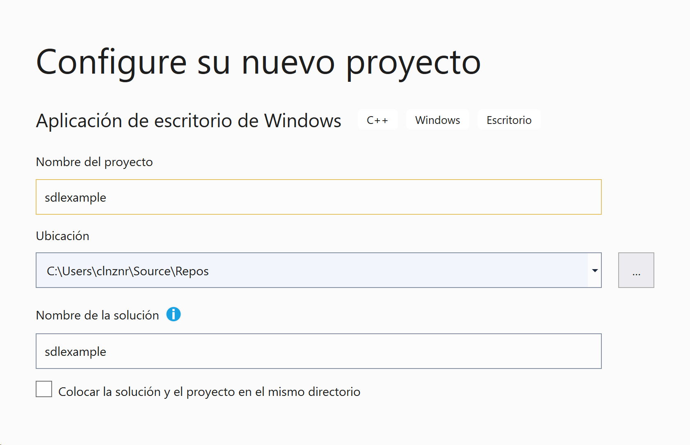
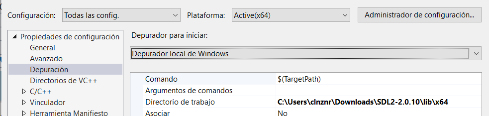
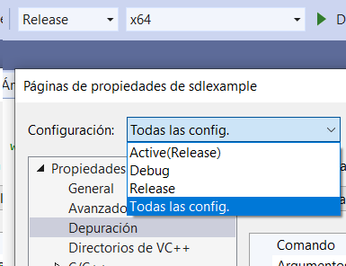

# Cómo se pasa de un ejecutable a C++

---

Crear un ejecutable desde código C++ implica *3 pasos*:

- **Preprocesado**
- **Compilación**
- **Enlazado**

---

## Desarrollo

`while(!terminado)`{.cpp}:

preprocesar $\rightarrow$ compilar $\rightarrow$ enlazar $\rightarrow$ depurar 

---

## Release

`if(fin)`{.cpp}:


preprocesar $\rightarrow$ compilar en release $\rightarrow$ enlazar con librerías release $\rightarrow$ empaquetar


---

## Preprocesado

---

El preprocesador es un programa que entiende directivas `#define`{.cpp}, `#include`{.cpp}, `#ifndef`{.cpp}

---

Esas directivas *no son sintaxis C/C++*

---

Es un proceso básico, muchas veces de simple reemplazo o elección de texto

---

Trabaja en un archivo cada vez, y no analiza si el C++ es correcto o no

---

Genera algo parecido a un archivo C++ alternativo, ya sin directivas, sólo con C++

Y se pasa a compilar


## Compilación

---

La compilación es la traducción de código C++ (ya con el preprocesador aplicado) a código máquina (que cambiará, dependiendo de la plataforma)

---

Los compiladores permiten generar código *objeto* por cada archivo de código de forma independiente

---

Es posible *compilar* correctamente archivos C++ que hacen referencia a funciones declaradas, pero no implementadas:

```cpp
void g();

void f() {
  g(); // válido para *compilar*
}
```

---

Si juntamos varios archivos en código objeto juntos, tenemos una *biblioteca estática* (*static library*)

---

Los errores de C++, o de llamadas a cosas no declaradas, ocurren durante el compilado

---

### Bibliotecas durante la compilación

Muchas funciones no las *declaramos* nosotros, pero sí las usamos

---

Como al compilador no le importa la implementación, sólo la declaración, nos vale con un *.h*:

```cpp
#include "SDL.h" // sólo declaraciones
```

---


## Enlazado

---

Enlazar consiste en convertir *varios archivos en código objeto* en un ejecutable o biblioteca de vínculo dinámico (*dynamic/shared library*)

---

Sólo se puede enlazar cosas que ya estén compiladas

Eso quiere decir que en enlazador (*linker*) da un tipo de errores que no son de C++, sino de enlazado de objetos

---

En general, estos errores ocurren cuando hemos usado una cosa que está declarada, pero no implementada:

```cpp
void g();

void f() {
  g(); // si ningún otro archivo implementa `g`
       // el enlazador dará un error
}
```

---


## Bibliotecas durante en enlazado

Durante en enlazado, hay que decirle al programa en qué archivos están los símbolos que no hemos creado nosotros

---

Es decir, hay que decirle dónde están los `.lib` (VS) que corresponden a los `.h`

---

Si hemos *compilado* con los `.h` correctos, pero no usamos los `.lib` correspondientes, tendremos un error de enlazado


# Configuraciones

---

Hay muchas maneras de traducir el código desde C++ a código máquina

---

Los compiladores ofrecen muchas opciones para decir qué tipo de traducción queremos hacer

--- 

## Arquitectura

Se puede generar código para 32 y 64 bits (usualmente)

---

Es importante usar bibliotecas que sean de la misma plataforma que nuestro ejecutable

---

## Optimización

Hay toda una familia de opciones (dependiendo del compilador) que permiten que se apliquen técnicas de traducción que generan un código más eficiente

---

Pueden cambiar la lógica de nuestro código, pero no el comportamiento final (...)

---

De hecho, hay algunas opciones de optimización "peligrosas": pueden cambiar la semántica del programa, a cambio de una optimización muy agresiva

(También las hay seguras)

---

## Depuración

---

Cuando compilamos, perdemos todo el código fuente

Entonces, ¿cómo sabe el depurador en qué línea *de código* estamos?

---

Con ciertas opciones, el compilador guarda información sobre la relación entre líneas de código máquina, y el código C++ correspondiente (archivo y línea)

---

Los símbolos de depuración pueden estar:

- En el ejecutable (`GCC`)
- En un archivo separado (`PDB` en VS)


# Opciones de ejecución

---

En un IDE no sólo construimos, también ejecutamos

---

Cuando un programa se ejecuta, se ejecuta en una ruta concreta, y esa es la ruta base

---

Podemos cambiar la ruta base, que es a partir de la cual el ejecutable encontrará los recursos:

```cpp
// /raiz_proyecto
//    ejecutable.exe
//    /subcarpeta
//        archivo.txt
//
file.open("subcarpeta/archivo.txt")
```


# Ejemplo GCC

---

Compilar:

```bash
gcc -c sdl.gcc -I/usr/local/include/SDL2
```

---

Enlazar:

```bash
gcc sdl.o -L/usr/local/lib -lSDL2 -o sdl.exe
```

---

Ejecutar:

```bash
./sdl.exe
```

---

Compilar y enlazar:

```
gcc sdl.cpp -I/usr/local/include/SDL2 -L/usr/local/lib -lSDL2 -o sdl.exe
```

---

Añadir información de depuración:

```bash
gcc -g sdl.cpp -I/usr/local/include/SDL2 -L/usr/local/lib -lSDL2 -o sdl.exe
```

---

Optimización

```bash
gcc -O2 sdl.cpp -I/usr/local/include/SDL2 -L/usr/local/lib -lSDL2 -o sdl.exe
```


# Ejemplo Visual Studio


---

{width=50%}

---

{width=50%}

---

{width=50%}

---

Lo reemplazamos por:

```cpp
#include "SDL.h"

int main(int char, char* argv[])
{
  return 0;
}
```

---

Es importante poner:

```cpp
int main(int char, char* argv[]) {}
```

y no sólo:

```cpp
int main() {}
```

Para que no haya problemas de enlazado con SDL


---


---


Ahí están:

- Los `.h` para compilar
- Los `.lib` para enlazar
- La `.dll` para ejecutar

---

## Rutas de "includes"


---


Vamos a establecer la misma ruta de `includes` para "Todas las configuraciones", en todas las plataformas


---

## Rutas de librerías

Para x64 (aquí ya importa la plataforma):


---

## Librerías


---

## Depuración



<small>La ruta tiene que contener el archivo `SDL2.dll`</small>

---

## Arquitectura


---

## *Release* vs. *Debug*



---

Se pueden crear todas las configuraciones que se quieran

---

*Debug* y *Release* son sólo 2 de ejemplo ya creadas, con parámetros razonables

---

## Consola/sin consola

Es útil tener la consola de Windows en *Debug*, y quitarla en *Release*

---

{width=60%}

---

{width=60%}
